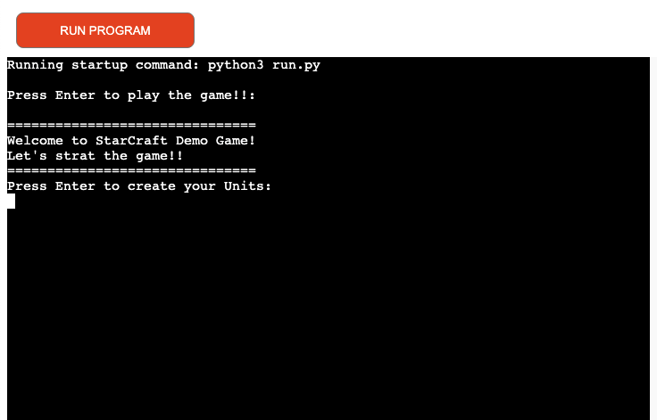
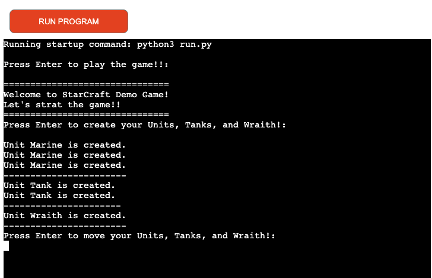
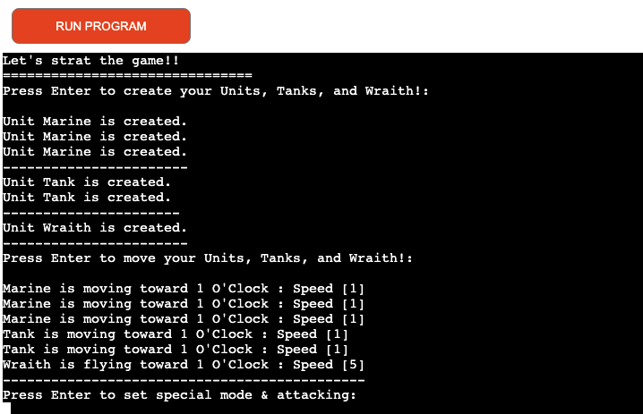
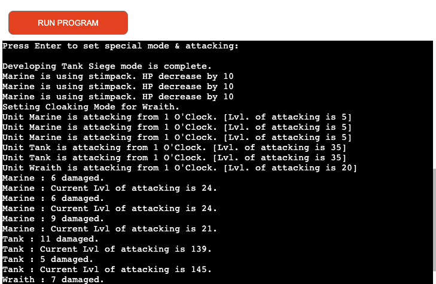
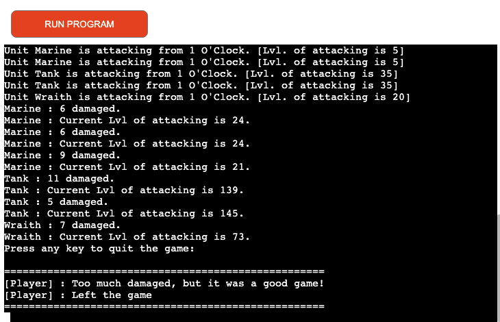

# StarCraft Demo Game

Welcome to StarCraft Demo Game!
As well known StarCraft game is the one of the most popular online games across the world, and I wanted to create the basic concept of the game.
This project shows how diversities of Units can be created, moving and attacking with their own specified skills.

[Here is the live version of my project](https://starcraft-demo-game.herokuapp.com/)

## What is StarCraft Game & How to play?
StarCraft is a war game of these three races, Terran(Human exiled from Earth), the Zerg(Monster) and Protoss(Alien). We are supposed to be a Terran
which we would understand this race better when we play the game. Terran has abilities of creating solders, Tanks, Flyable attacking weapons as fast
as the most amount that can be attacked and destroyed the enemies. Find more about [Wikipedia.](https://en.wikipedia.org/wiki/StarCraft)

This project will only show upto creating Units, Flyable Units, which both can attack with special Modes(skills per unit), and levels of attacking power and numbers of damge per unit.

## Game Design

* These child classes of Marine, Tank, and Wraith are defined different skills of each unit as methods, and general actions such as attack, movement and damage are defined and used in the parent classes through inheritance.
* Since Flyable Attack units do not move through the ground, but move through the air, it overrides the Unit class's move() method to call Flyable's fly() method and redefined.
* With this structure, all units can be moved without distinction between ground and air via the move() method.

## Features
### Exsiting Features
* Start game

* Create Units (3 Mrines, 2 Tanks, 1 Wraith)

* All Units move toward 1 O'clock

* Developing Tank Siege Mode
* Be ready to attack (Stimpack of Marine, Seige Mode of Tank, Cloaking Mode of Wraith)
  - All Units attack toward 1 O'clock
  - All Units got damaged
  

* Game over

### Future Features
* As this should be online game, will need to create global users interactions and functions
* Need to have abilities of creating more units, weapons by further stretegy
* Graphic/motion can be added

## Data Model
I decided to use a online demo game as my model. The game creates Units, Tanks, and Wraith to be ready to attck the enemies with specific modes and skill s that could make you stronger.

As this game should be played by more than 1 player, can be cooperated online, this demo game is only introducing about the game.

## Testing
I have manually tested this project as follow:
* Passed the code throught a PEP8 Linter and confirmed there are no problems
* Tested in my local terminal and the Code Institude Heroku terminal

### Bugs
Issue with print f string and fixed with str.format{}. Updated all relevant syntaxs for print to this way.

### Remaining Bugs
No bugs remaining

### Validator Testing
* PEP8 : no errors were returned from PEP8online.com

### Deployment
- This project was deployed using Code Institute's mock terminal for Heroku.
  - Fork or cclone this repository
  - Create a new Heroku app
  - Set the buildbacks to Python and NodeJS in that order
  - Link the Heroku app to the repository
  - Click on Deploy

### Credit
- Code Institute for the deployment terminal
- Wikipedia for the details of the StarCraft game
- [YouTube](https://www.youtube.com/watch?v=XGf2GcyHPhc) for inspiration
- [Python Class Method](https://pynative.com/python-class-method/#:~:text=Delete%20Class%20Methods-,What%20is%20Class%20Method%20in%20Python,the%20object%20of%20the%20class.) to lookup
- [Python Inheritance Override Method with W3school.com](https://www.w3schools.com/python/python_inheritance.asp) to lookup
